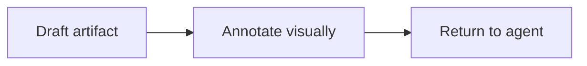
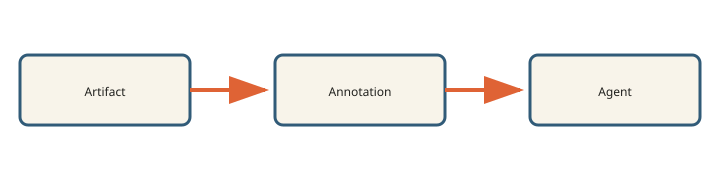

# Field Notes on Small Tools

Small tools earn trust through a short, visible loop. They accept one thing, perform one legible transformation, and leave behind an inspectable result.

## The annotation loop

An artifact should open in the form its author intended. Markdown becomes a document rather than source text. HTML retains its layout and behavior. Feedback stays attached to the passage or element that prompted it.

> Precision matters, but every anchor should still make sense when read on its own.

## A compact contract

| Input | Interaction | Output |
| --- | --- | --- |
| One local artifact | Anchored comments | One annotation bundle |

The process ends when the reviewer submits the complete bundle.

## Diagram support

